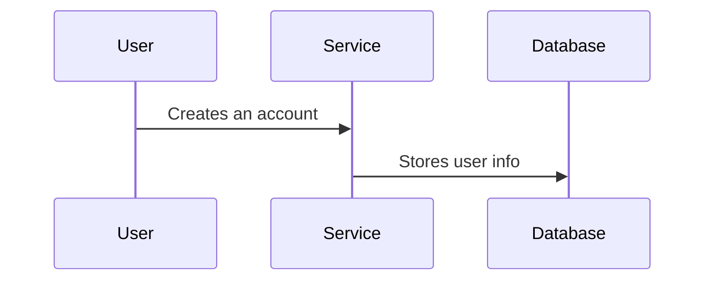
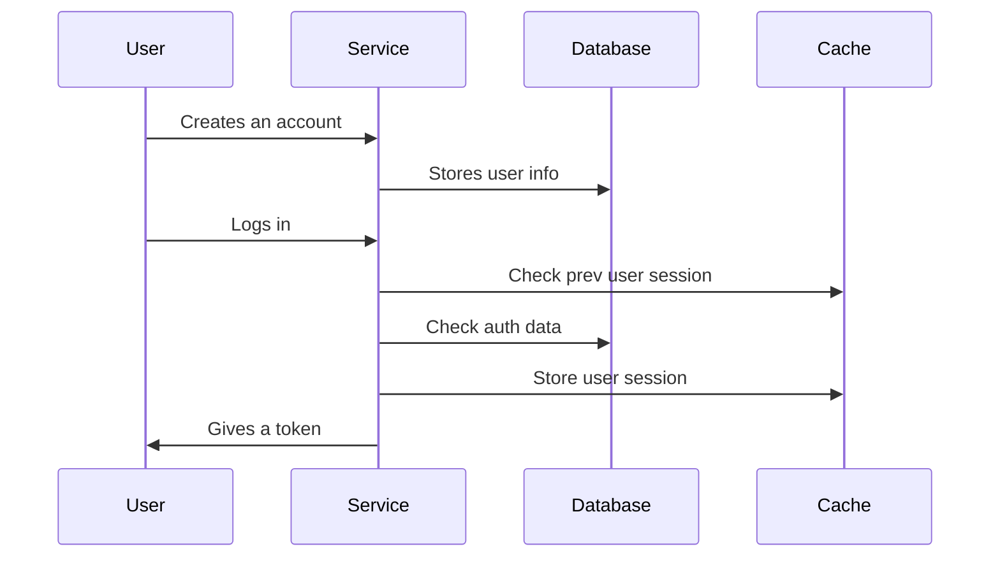

# Users service

The goal of the users service is to manage all the user accounts and their sessions through the application.

### User signup

```mermaid
    sequenceDiagram
        User ->> Service: Creates an account
        Service ->> Database: Stores user info
```

### User login

```mermaid
    sequenceDiagram
    User ->> Service: Creates an account
    Service ->> Database: Stores user info

    User ->> Service: Logs in
    Service ->> Cache: Check prev user session
    Service ->> Database: Check auth data
    Service ->> Cache: Store user session
    Service ->> User: Gives a token
```
